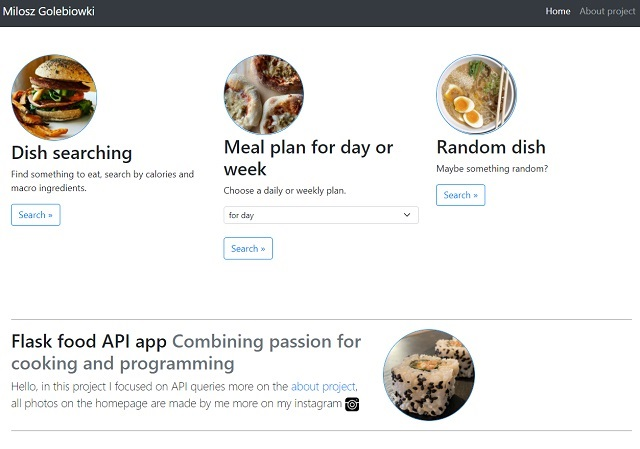

Project Name: Food Flask app

briefly about the application:
I used here API spoonacular to create all API queries where you can search dishes by different categories. Such as: diet type,calories, macro ingredients or random, you can also choose a daily or weekly plan. Website front-end is based on bootstrap.

How To Setup
1. Clone This Project git clone 
2. Enter Project Directory cd food_flask_app
3. Create a Virtual Environment (for Windows) py -m venv (name your virtual enviroment :) venv
- py -m venv venv
4. Activate Virtual Environment source: venv/Scripts/activate
5. Install Requirements Package pip install -r requirements.txt
6. Finally Run The Project:
python app.py

Preview

